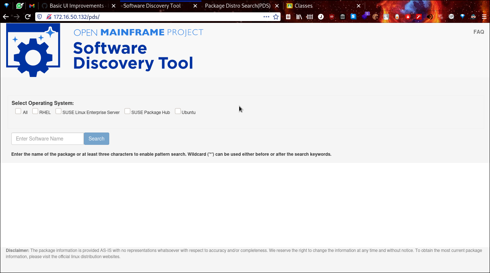

# Software Discovery Tool Weekly Report: Week 1

## 1-4 June 2021

### Project Members

 * Elizabeth K. Joseph (Mentor)
 * Indranil Mandal (Student)
 * Divya Goswami (Student)

### Accomplishments for the week

 * Initial team meeting on 1 June
 * Completed PDS rename tasks tracked in [Issue 20](https://github.com/openmainframeproject/software-discovery-tool/issues/20) and implemented in [PR 25](https://github.com/openmainframeproject/software-discovery-tool/pull/25)
 * Added logo to UI, tracked in [Issue 26](https://github.com/openmainframeproject/software-discovery-tool/issues/26) and implemented in [PR 27](https://github.com/openmainframeproject/software-discovery-tool/pull/27)

### List of Milestones to be completed and anticipated date (indicate which ones are in danger of not being met) 

### List of issues, problems, or concern(s)
