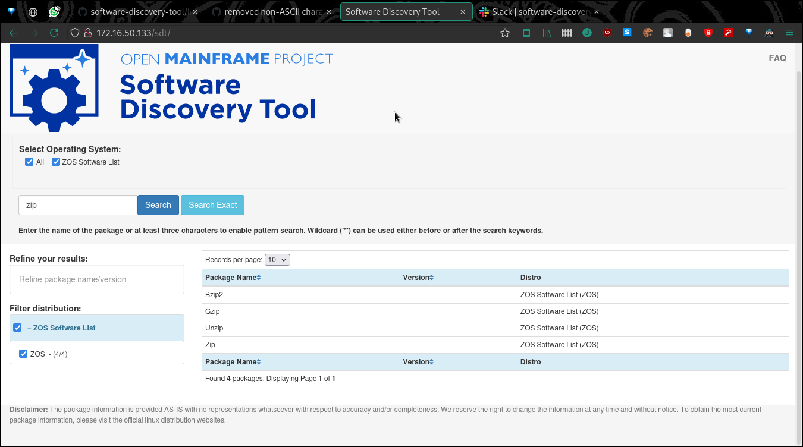

# Software Discovery Tool Weekly Report: Week 4

## 21-25 June 2021

### Project Members

 * Elizabeth K. Joseph (Mentor)
 * Indranil Mandal (Student)
 * Divya Goswami (Student)

### Accomplishments for the week

 * Identified [Issue 5](https://github.com/openmainframeproject/software-discovery-tool-data/issues/5)
 * Initial distro data for z/OS done! [PR 6](https://github.com/openmainframeproject/software-discovery-tool-data/pull/6)
 * Identified [Issue 7](https://github.com/openmainframeproject/software-discovery-tool-data/issues/7), solved with [PR 8](https://github.com/openmainframeproject/software-discovery-tool-data/pull/8) and will be more diligent about special characters in data files
 * Identified [Issue 36](https://github.com/openmainframeproject/software-discovery-tool/issues/36)
 * Documenting usage of git submodules and link completed in [PR 37](https://github.com/openmainframeproject/software-discovery-tool/issues/36)
 * Identified [Issue 39](https://github.com/openmainframeproject/software-discovery-tool/issues/39)
 * Preliminary import work for Debian JSON file support
 * Working example for z/OS!

### List of Milestones to be completed and anticipated date (indicate which ones are in danger of not being met) 

### List of issues, problems, or concern(s)
