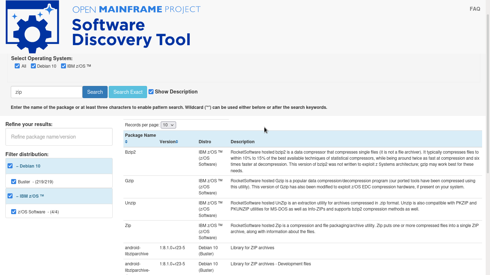

# Software Discovery Tool Weekly Report: Week 4

## 5 - 9 July 2021

### Project Members

 * Elizabeth K. Joseph (Mentor)
 * Indranil Mandal (Student)
 * Divya Goswami (Student)

### Accomplishments for the week
- Description feature working! Here's a screenshot:

- Debian data imported through [PR 9](https://github.com/openmainframeproject/software-discovery-tool-data/pull/9)
- automated script added for pulling data from PDS and pulling fresh data for Debian
- Identified [Issue 45](https://github.com/openmainframeproject/software-discovery-tool/issues/45)
- Improvements discussed [Issue 50](https://github.com/openmainframeproject/software-discovery-tool/issues/50), [Issue 47](https://github.com/openmainframeproject/software-discovery-tool/issues/47) and [Issue 46](https://github.com/openmainframeproject/software-discovery-tool/issues/46)

### List of Milestones to be completed and anticipated date (indicate which ones are in danger of not being met) 

### List of issues, problems, or concern(s)
