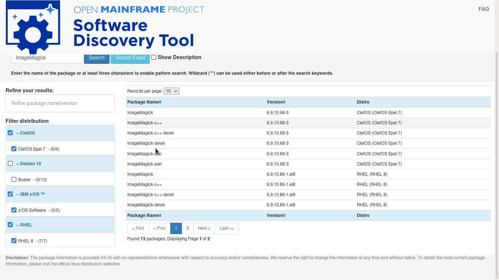

# Software Discovery Tool Weekly Report: Week 7

## 12 - 16 July 2021

### Project Members

 * Elizabeth K. Joseph (Mentor)
 * Indranil Mandal (Student)
 * Divya Goswami (Student)

### Accomplishments for the week
- Description feature issue for PDS fixed through [PR 53](https://github.com/openmainframeproject/software-discovery-tool/pull/53)
- Clef data imported through [PR 12](https://github.com/openmainframeproject/software-discovery-tool-data/pull/12)
- automated script updated for pulling data ClefOS through [PR 54](https://github.com/openmainframeproject/software-discovery-tool/pull/54)
- UI Improvements [PR 55](https://github.com/openmainframeproject/software-discovery-tool/pull/55)

### List of Milestones to be completed and anticipated date (indicate which ones are in danger of not being met) 

### List of issues, problems, or concern(s)
