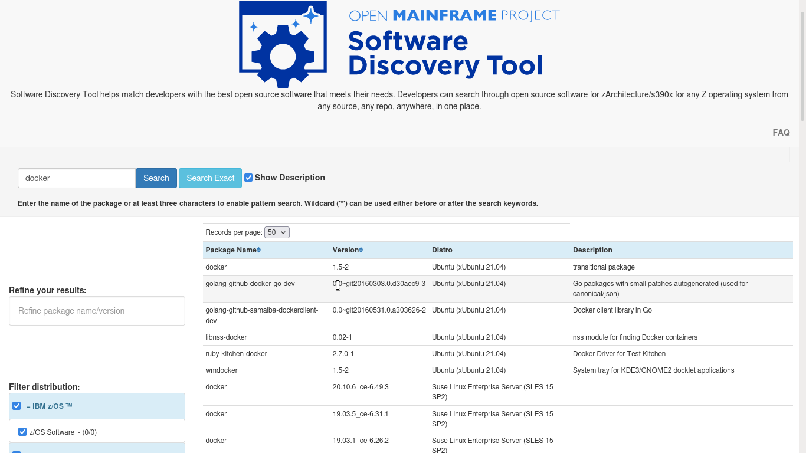

# Software Discovery Tool Weekly Report: Week 9

## 26 - 31 July 2021

### Project Members

 * Elizabeth K. Joseph (Mentor)
 * Indranil Mandal (Student)
 * Divya Goswami (Student)

### Accomplishments for the week
- Added SUSE data lists through [PR 14](https://github.com/openmainframeproject/software-discovery-tool-data/pull/14)
- Update Final UI for OMP and main site description through [PR 61](https://github.com/openmainframeproject/software-discovery-tool/pull/61)
- CI/CD Manual workflows automated through [PR 62](https://github.com/openmainframeproject/software-discovery-tool/pull/62)
- Successful testing of CI/CD Pipeline (waiting for final server creds) [PR 64](https://github.com/openmainframeproject/software-discovery-tool/pull/64)

### List of Milestones to be completed and anticipated date (indicate which ones are in danger of not being met) 

### List of issues, problems, or concern(s)
