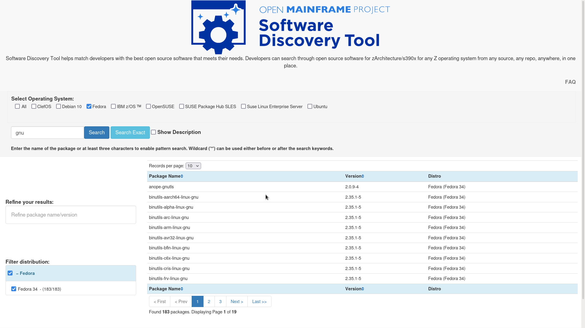

# Software Discovery Tool Weekly Report: Week 10

## 01 - 07 August 2021

### Project Members

 * Elizabeth K. Joseph (Mentor)
 * Indranil Mandal (Student)
 * Divya Goswami (Student)

### Accomplishments for the week
- Added Fedora data lists through [PR 16](https://github.com/openmainframeproject/software-discovery-tool-data/pull/16)
- Tested independent deploy on seperated repo [PR 1](https://github.com/openmainframeproject/software-discovery-tool-deploy/pull/1)
- Updated automated script and data of previous distros [PR 66](https://github.com/openmainframeproject/software-discovery-tool/pull/66)

### List of Milestones to be completed and anticipated date (indicate which ones are in danger of not being met) 

### List of issues, problems, or concern(s)
