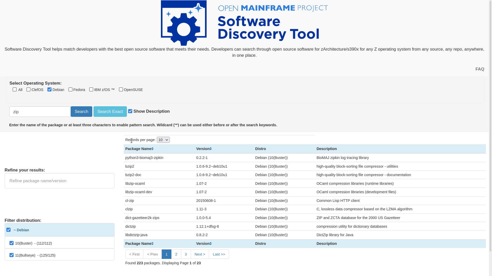

# Software Discovery Tool Weekly Report: Week 12

## 23 - 28 August 2021

### Project Members

 * Elizabeth K. Joseph (Mentor)
 * Indranil Mandal (Student)
 * Divya Goswami (Student)

### Accomplishments for the week
- Bullseye data is now supported and script is updated through [PR](https://github.com/openmainframeproject/software-discovery-tool/pull/68)
- Bullseye Data and other distro updates added through [PR](https://github.com/openmainframeproject/software-discovery-tool-data/pull/21)

### List of Milestones to be completed and anticipated date (indicate which ones are in danger of not being met) 

### List of issues, problems, or concern(s)
